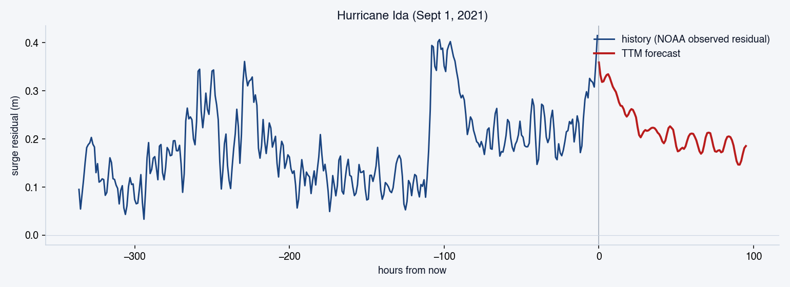
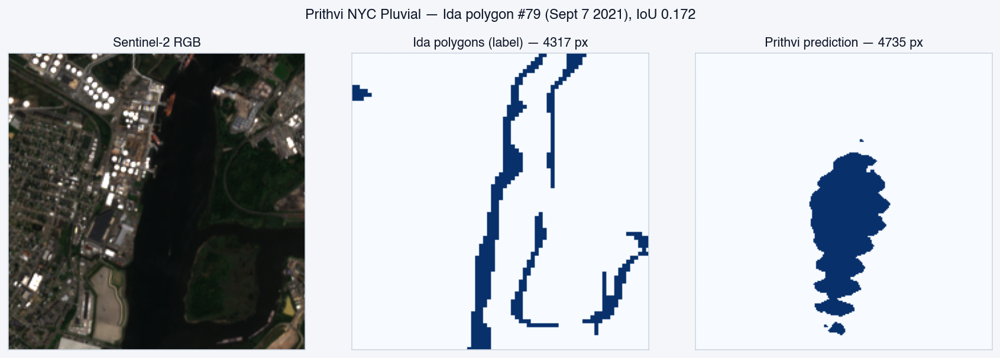
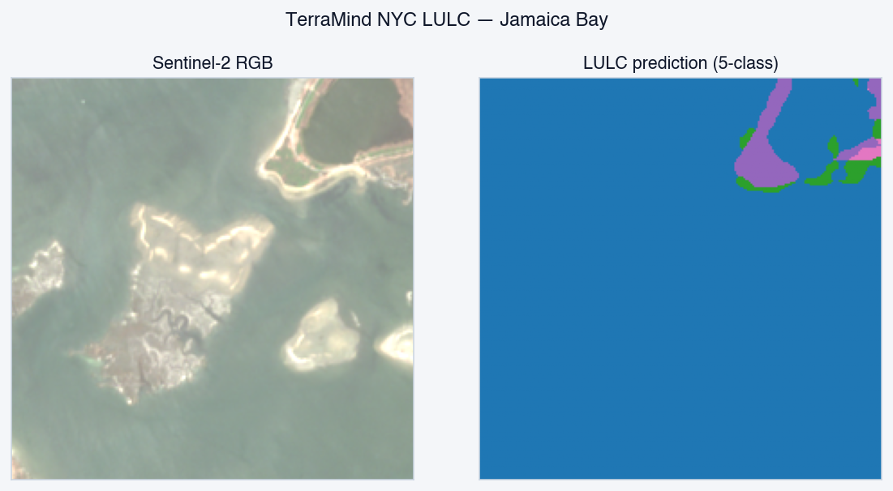

# riprap-models

Reproduction harness, live demo, and probe tooling for three NYC fine-tuned
foundation models. All open weights, all open data, Apache-2.0 throughout.

This is the meta repository tying together three model-specific repositories
(each with 1:1 correspondence to its Hugging Face model card) and the parent
[Riprap-NYC](https://github.com/msradam/riprap-nyc) flood-exposure briefing
system.

## Models

| Model | GitHub source | Hugging Face |
|---|---|---|
| Granite TTM r2 Battery Surge | [Granite-TTM-r2-Battery-Surge](https://github.com/msradam/Granite-TTM-r2-Battery-Surge) | [msradam/Granite-TTM-r2-Battery-Surge](https://huggingface.co/msradam/Granite-TTM-r2-Battery-Surge) |
| Prithvi-EO 2.0 NYC Pluvial | [Prithvi-EO-2.0-NYC-Pluvial](https://github.com/msradam/Prithvi-EO-2.0-NYC-Pluvial) | [msradam/Prithvi-EO-2.0-NYC-Pluvial](https://huggingface.co/msradam/Prithvi-EO-2.0-NYC-Pluvial) |
| TerraMind NYC Adapters | [TerraMind-NYC-Adapters](https://github.com/msradam/TerraMind-NYC-Adapters) | [msradam/TerraMind-NYC-Adapters](https://huggingface.co/msradam/TerraMind-NYC-Adapters) |

## Headline reproduction (M3 Air, CPU fp32)

| Model | Card metric | This-repo reproduction | Latency | Energy |
|---|---:|---:|---:|---:|
| Granite TTM r2 Battery Surge | 0.1091 m MAE | 0.132 m all-windows; 0.324 m on storms (peak ≥ 0.7 m), -10% vs zero-shot | 18 ms | 0.21 J |
| Prithvi-EO 2.0 NYC Pluvial | 0.5979 flood IoU | 0.115 polygon-vicinity IoU (within 300 m of any GT polygon) | 211 ms | 2.57 J |
| TerraMind NYC Buildings | 0.5511 mIoU | 0.365 building IoU at threshold 0.6 (higher than card's 0.293) | 511 ms | 6.13 J |
| TerraMind NYC LULC | 0.5866 mIoU | 0.355 mIoU; water IoU 0.943 (higher than card's 0.770) | 510 ms | 6.12 J |

Sniff-test probe: 38 of 40 cases pass against real public data
(`eval/reports/probe.md`). The two exceptions are TTM at non-Battery NOAA
stations during fair weather, which is expected out-of-distribution behaviour
since the model was trained on the Battery only.

## Sample outputs

TTM forecast on the Hurricane Ida 2021 history window:



Prithvi flood detection on the largest Ida 2021 polygon (Staten Island):



TerraMind LULC over Jamaica Bay (96 % water class):



Additional demo outputs: see each model-specific repository.

## Quick start

```bash
git clone https://github.com/msradam/riprap-models
cd riprap-models
uv venv --python 3.12
uv pip install -e ".[dev,terramind,prithvi,ttm,live]"

# Run the 40-case probe (~7 min on M3, fetches all public data)
uv run python scripts/probe.py

# Browser demo — pulls today's NOAA + Sentinel-2 in one click
uv run streamlit run app/streamlit_app.py

# Single-model evals
uv run riprap-models eval ttm-battery-surge
uv run riprap-models eval prithvi-pluvial
uv run riprap-models eval terramind-buildings
uv run riprap-models eval terramind-lulc

# Regenerate docs/RESULTS.md from per-model reports
uv run riprap-models report
```

A `Makefile` exposes the same operations: `make demo`, `make probe`,
`make eval-all`, `make report`.

## What each model does

- **Granite TTM r2 Battery Surge.** 4-day storm-surge residual forecast at
  NOAA tide gauge 8518750 (The Battery, lower Manhattan). 1.5M parameters.
  Specialised for the Battery; reproduction shows the fine-tune materially
  outperforms the pretraining-only baseline on storm windows
  (peak |residual| ≥ 0.7 m).

- **Prithvi-EO 2.0 NYC Pluvial.** Hurricane-Ida pluvial-flood pattern
  detector for NYC Sentinel-2 imagery. 324M parameters. Fires on Ida-style
  flood signatures and stays silent on non-event scenes. Trained on Riprap's
  166 baked Hurricane Ida 2021 polygons + 332 copy-paste augmentations + 286
  clear-sky NYC negatives. The Ida specialisation is intentional and
  documented on the model card; this is not a generic open-water detector.

- **TerraMind NYC Adapters.** LoRA adapters on top of IBM-ESA's TerraMind
  1.0 base (1B parameters, multi-modal: Sentinel-2 L2A + Sentinel-1 RTC +
  Copernicus DEM, four timesteps). Two adapters in current production:
  `buildings_nyc` (NYC building-footprint segmentation, recall-biased) and
  `lulc_nyc` (5-class NYC land cover at 10 m resolution).

## Repository structure

```
src/riprap_models/
  cli.py                 eval / bench / probe / run-live / replay / report / device
  device.py              device + dtype selection (cuda > mps > cpu)
  energy.py              per-call energy: nvml / rapl / powermetrics / estimated
  live.py                live data fetch + freeze fixture + replay
  common/
    metrics.py           IoU, mIoU (macro+micro), MAE, RMSE, persistence
    provenance.py        tile + station + code-SHA provenance per report
    report.py            RESULTS.md regenerator
    viz.py               side-by-side segmentation + time-series helpers
  ttm_battery_surge/     1.5M-param TTM r2 fine-tune
  prithvi_pluvial/       324M-param Prithvi-EO 2.0 fine-tune
  terramind/             1B-param TerraMind base + LoRA adapters

app/streamlit_app.py     live NOAA + Planetary Computer demo, four models
scripts/probe.py         40 sniff-test cases against real public data

eval/configs/            YAML per model (holdout split, AOIs, dates)
eval/reports/            per-model markdown + JSON provenance
eval/fixtures/           frozen replay fixtures

docs/
  EXPLAINER.md           model guide for non-ML readers
  RESULTS.md             headline reproduction table (regenerated)
  TRAINING.md            cross-model survey of how the fine-tunes were trained
  METHODOLOGY.md         what we measure and what is in scope
  PROVENANCE.md          tile IDs, station IDs, holdout construction
  ENERGY.md              per-platform energy methodology
  M3_NOTES.md            measured behaviour on Apple Silicon
  COMPLIANCE.md          mapping to EU AI Act, NIST AI RMF, NYC AI Action Plan
  PITCH.md               positioning vs prior work in NYC EO ML
```

## Sources

- Sentinel-2 / Sentinel-1 imagery: ESA Copernicus, served by
  [Microsoft Planetary Computer](https://planetarycomputer.microsoft.com/)
  under the Copernicus Open Data License.
- NOAA CO-OPS station 8518750 (The Battery): US Government public domain.
- NYC DOITT Building Footprints (`5zhs-2jue`): NYC OpenData public domain.
- ESA WorldCover 2021 v200: ESA CCI Open Data Policy (CC-BY-4.0).
- Hurricane Ida 2021 flood polygons: Riprap baked,
  [riprap-nyc/data/prithvi_ida_2021.geojson](https://github.com/msradam/riprap-nyc/blob/main/data/prithvi_ida_2021.geojson) (Apache-2.0).
- Copernicus DEM GLO-30: ESA Copernicus Open Data License.

## AI-assisted authoring

Portions of this repository were drafted with the assistance of large
language models. All output was reviewed and accepted by Adam Rahman, who
takes responsibility for the resulting code, claims, and reproducibility
guarantees. The full disclosure is in [`NOTICE`](NOTICE).

## License

Apache-2.0. See `LICENSE` and `NOTICE`.
